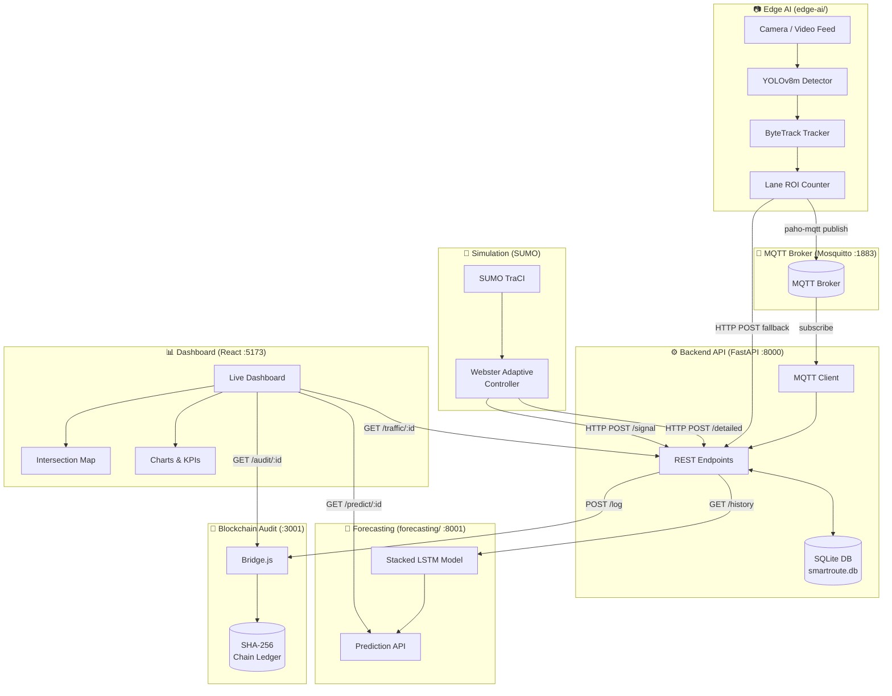

# 🏗️ SmartRoute — System Architecture

> **Team Path Finders | SIH 2025**
> Decentralized, Adaptive, and Trustworthy Traffic Control

---

## Overview

SmartRoute replaces fixed-time traffic signals with an AI-driven adaptive system that:
- Detects vehicles in real-time using **YOLOv8** computer vision
- Controls signals adaptively using **Webster's formula**
- Predicts congestion **15 minutes ahead** using an LSTM neural network
- Logs every signal change to a **tamper-proof blockchain audit trail**
- Displays everything on a **live web dashboard**

---

## System Architecture



---

## Data Flow

```
Camera Frame
  │
  ▼
YOLOv8m (vehicle detection, 30 FPS)
  │ detections: [track_id, class, cx, cy]
  ▼
ByteTrack (unique vehicle tracking)
  │
  ▼
Lane ROI Polygons (which lane is each vehicle in?)
  │
  ▼ every 2 seconds
MQTT Topic: smartroute/intersection_1/vehicles
  │
  ▼
Backend MQTT Client → FastAPI → SQLite (persisted)
  │
  ├──► Dashboard (REST polling every 3s)
  ├──► LSTM Forecast API (GET /predict/:id)
  └──► Blockchain Audit (POST /log on signal change)
```

---

## Module Reference

| Module | Port | Language | Purpose |
|---|---|---|---|
| `edge-ai/` | — | Python | YOLOv8 detection + MQTT publish |
| `backend/` | `:8000` | Python (FastAPI) | Central REST API + SQLite |
| `forecasting/` | `:8001` | Python (FastAPI) | LSTM predictions |
| `blockchain/` | `:3001` | Node.js (Express) | Audit trail |
| `dashboard/` | `:5173` | React + Vite | Live UI |
| `simulation/` | — | Python (TraCI) | SUMO adaptive controller |

---

## API Reference

### Backend (`localhost:8000`)

| Method | Endpoint | Description |
|---|---|---|
| `GET` | `/` | Health check |
| `GET` | `/intersections` | List all intersections |
| `GET` | `/traffic/{id}` | Current state |
| `GET` | `/traffic/{id}/history?limit=N` | Last N readings (persisted) |
| `POST` | `/traffic/{id}/update?vehicle_count=N` | Simple count update |
| `POST` | `/traffic/{id}/detailed` | Full lane-level update |
| `POST` | `/traffic/{id}/signal?signal=X` | Update signal phase from simulation |
| `DELETE` | `/traffic/{id}/reset` | Clear history |

### Forecasting (`localhost:8001`)

| Method | Endpoint | Description |
|---|---|---|
| `GET` | `/predict/{id}` | Next-step prediction |
| `GET` | `/predict/{id}/horizon?steps=450` | 15-minute forecast |
| `GET` | `/predict/{id}/congestion` | Risk level + recommendation |

### Blockchain (`localhost:3001`)

| Method | Endpoint | Description |
|---|---|---|
| `POST` | `/log` | Record a signal event |
| `GET` | `/audit/{id}` | Full history for intersection |
| `GET` | `/verify/{hash}` | Verify block integrity |
| `GET` | `/stats` | Chain-wide stats |

---

## Webster's Adaptive Algorithm

Webster's formula calculates the **optimal cycle length** based on real-time queue counts:

```
C* = (1.5 × L + 5) / (1 - Y)

where:
  C* = optimal cycle length (seconds)
  L  = total lost time per cycle (≈ n_phases × 3s yellow)
  Y  = sum of critical flow ratios (q_i / s_i)
  q_i = arrival rate on approach i (veh/s)
  s_i = saturation flow rate (≈ 1800 veh/hr per lane)
```

Green time per phase is then split proportionally to the queue ratio:
```
g_NS = (q_NS / (q_NS + q_EW)) × (C* - L)
g_EW = C* - L - g_NS
```

---

## Database Schema

```sql
-- Current state (one row per intersection)
CREATE TABLE intersections (
    intersection_id  TEXT PRIMARY KEY,
    vehicle_count    INTEGER DEFAULT 0,
    signal_state     TEXT DEFAULT 'GREEN',
    algorithm        TEXT DEFAULT 'adaptive',
    lanes            TEXT DEFAULT '{}',   -- JSON
    unique_total     INTEGER DEFAULT 0,
    last_updated     TEXT
);

-- Historical readings (persistent, survives restart)
CREATE TABLE traffic_readings (
    id               INTEGER PRIMARY KEY AUTOINCREMENT,
    intersection_id  TEXT NOT NULL,
    vehicle_count    INTEGER NOT NULL,
    signal_state     TEXT NOT NULL,
    lanes            TEXT DEFAULT '{}',   -- JSON
    timestamp        TEXT NOT NULL
);
```
